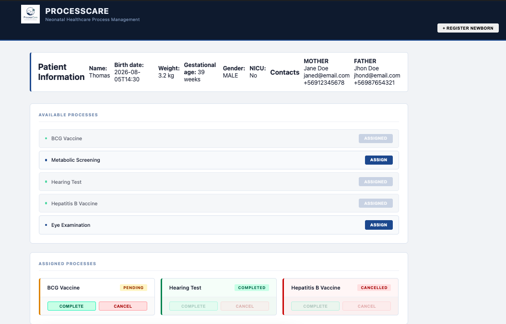

# ProcessCare Frontend

## Overview

**ProcessCare** is a TypeScript frontend application designed to support the management of neonatal healthcare processes in a Neonatal Intensive Care Unit (NICU).

The application allows healthcare staff to register newborn patients, visualize clinical information, manage parent or guardian contacts, assign healthcare processes, and update the status of each assigned process.

This project was developed for **Hito 2**, focusing on:

- TypeScript best practices
- Strong typing and data modeling
- Secure DOM manipulation
- Form validation
- Asynchronous programming
- Modular application architecture

---

# Features

- Register newborn patients through a validated form.
- Display complete newborn clinical information.
- Manage parent or guardian contact information.
- Validate newborn registration data.
- View available healthcare processes.
- Assign healthcare processes to newborn patients.
- Update assigned process status:
  - Pending
  - Completed
  - Cancelled
- Display loading states during asynchronous operations.
- Display error messages when operations fail.

---

# Technologies

- TypeScript
- HTML5
- CSS3
- Vite

---

# Application Architecture

The project follows a modular architecture based on separation of responsibilities.

The application is divided into different layers:

---

## Components

Responsible for generating and managing reusable interface sections.

Implemented components:

- Header
- Patient Information section
- Newborn registration form
- Healthcare process cards

Components are responsible only for UI generation and interaction binding.

---

## Services

Responsible for asynchronous data operations and communication with application data sources.

Implemented services:

- Load newborn information
- Load healthcare processes
- Load assigned processes
- Save newborn registration data

The service layer separates data handling from the user interface.

---

## Models

Contains the TypeScript definitions of the business domain.

### Interfaces

- Newborn
- Contact
- HealthcareProcess
- AssignedProcess

### Enumerations

- Gender
- Relationship
- ProcessStatus

These models guarantee strong typing throughout the application.

---

## Validation Layer

Business validation rules are separated from form handling logic.

The validation layer verifies that newborn registration data meets the required rules before saving information.

---

# Project Structure

```text
processcare-frontend/
│
├── public/
│   └── logo.png
│
├── src/
│   │
│   ├── assets/
│   │   └── styles.css
│   │
│   ├── components/
│   │   ├── Header.ts
│   │   ├── PatientInfo.ts
│   │   ├── NewbornForm.ts
│   │   ├── NewbornFormFields.ts
│   │   ├── NewbornValidation.ts
│   │   └── ProcessCard.ts
│   │
│   ├── data/
│   │   ├── newborn.json
│   │   ├── healthcareProcesses.json
│   │   └── assignedProcesses.json
│   │
│   ├── models/
│   │   ├── index.ts
│   │   └── process.ts
│   │
│   ├── services/
│   │   ├── processService.ts
│   │   └── newbornService.ts
│   │
│   └── main.ts
│
├── index.html
├── package.json
├── tsconfig.json
├── vite.config.ts
└── README.md
```

---

# Hito 2 Requirements

## 1. Data Modeling with TypeScript

The application uses TypeScript interfaces and enums to represent the neonatal healthcare domain.

### Implemented Interfaces

```text
Newborn
Contact
HealthcareProcess
AssignedProcess
```

### Implemented Enums

```text
Gender
Relationship
ProcessStatus
```

### Benefits

The use of TypeScript models provides:

- Strong compile-time validation.
- Safer data manipulation.
- Improved maintainability.
- Better code readability.
- Avoidance of the `any` type.

---

# 2. Secure DOM Manipulation and Form Handling

The application interacts with the DOM using TypeScript type guards to ensure safe element handling.

## DOM Safety

Implemented checks for:

```text
HTMLFormElement
HTMLInputElement
HTMLSelectElement
HTMLButtonElement
HTMLParagraphElement
```

## Example Practices

- Validate DOM elements before usage.
- Avoid unsafe element casting.
- Ensure correct element types before accessing values.

---

# Newborn Registration Form

The newborn registration form includes:

- Patient information.
- Birth date and time.
- Weight.
- Gestational age.
- Gender.
- NICU admission status.
- Parent or guardian contact information.

The form uses:

- `preventDefault()` to avoid page reload.
- Typed DOM access.
- Validation before saving.
- Error feedback messages.
- Asynchronous saving process.

---

# Implemented Validations

The application validates:

- ID must be greater than zero.
- Name is required.
- Name cannot contain only numbers.
- Birth date is required.
- Birth date cannot be in the future.
- Weight must be between 0.5 and 8 kg.
- Gestational age must be between 22 and 45 weeks.
- Contact name is required.
- Email format validation.
- Phone number validation.

These validations represent basic business rules for neonatal registration.

---

# 3. Asynchronous Architecture

The application uses asynchronous programming to simulate communication with external services.

## Implemented Techniques

- `async / await`
- `Promise.all()`
- `try / catch`

---

## Data Operations

The application performs asynchronous operations for:

- Loading newborn information.
- Loading healthcare processes.
- Loading assigned processes.
- Saving new newborn registrations.

---

## User Experience

The application provides:

- Loading messages while retrieving information.
- Error messages when operations fail.
- Automatic UI refresh after successful operations.

---

# Application Workflow

1. The application starts.
2. Initial data is loaded asynchronously.
3. Newborn information is displayed.
4. Healthcare processes are displayed.
5. Users can assign processes to the newborn.
6. Users can complete or cancel assigned processes.
7. Newborn registration can be performed through the validated form.
8. Data is updated after successful operations.

---

# Code Quality Practices

The project applies the following practices:

- Separation of concerns.
- Modular component design.
- Reusable functions.
- Clear responsibility between layers.
- Strong TypeScript typing.
- No usage of `any`.
- Safe DOM manipulation.
- Validation separated from UI logic.
- Error handling with `try/catch`.
- Clean asynchronous flow.

---

# Learning Outcomes

This project demonstrates practical application of:

- TypeScript Interfaces.
- TypeScript Enums.
- Strict typing.
- DOM type guards.
- Event handling.
- Form processing.
- Business validation rules.
- Async/Await programming.
- Promise-based operations.
- Error handling.
- Modular frontend architecture.

---

# How to Run

Clone the repository:

```bash
git clone https://github.com/valehd/processcare-frontend.git
```

Navigate to the project folder:

```bash
cd processcare-frontend
```

Install dependencies:

```bash
npm install
```

Start the development server:

```bash
npm run dev
```

Open the local URL provided by Vite.

---

# Repository

GitHub Repository:

https://github.com/valehd/processcare-frontend

---




# Author

**Valentina Hernández**

2026